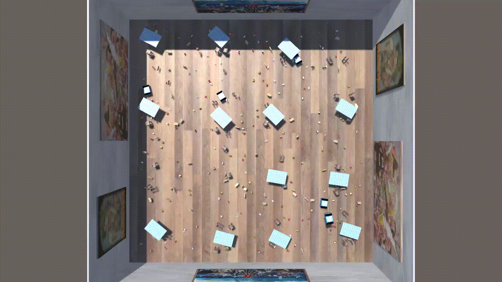
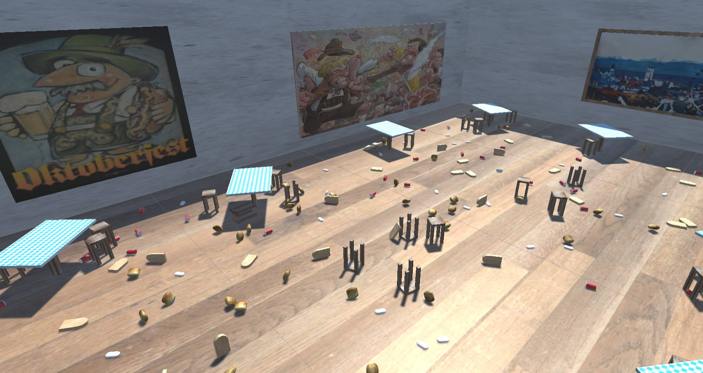
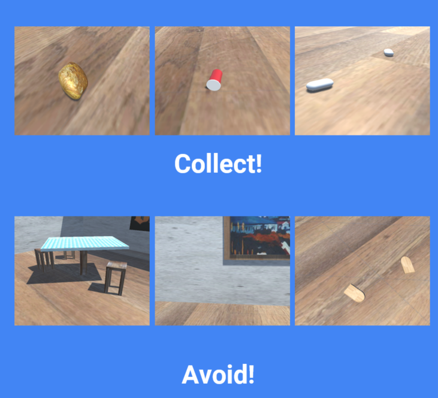
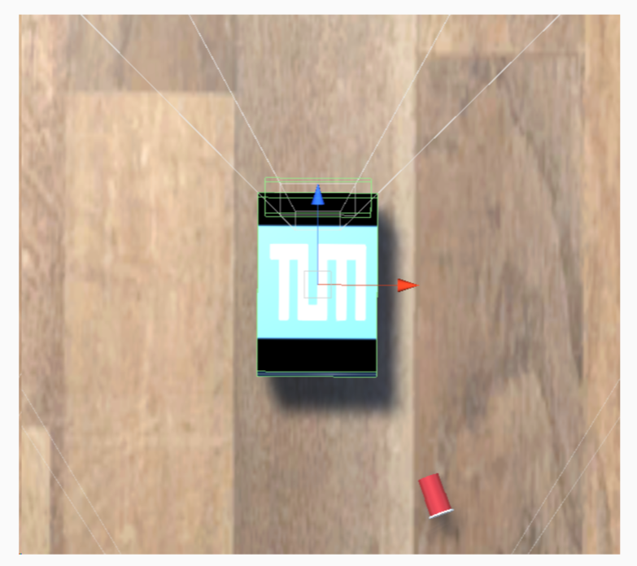
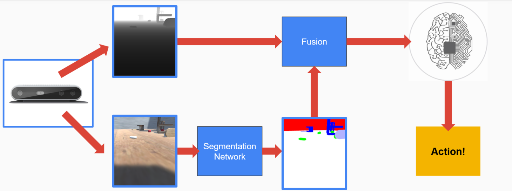
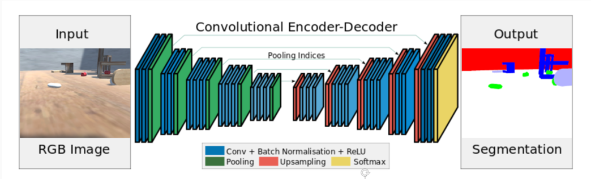

在过去的几个月里，我们开发了一个用于垃圾收集的自主智能体原型，利用我们在计算机视觉，深度强化学习和游戏开发领域的知识来创建自主进行垃圾收集的机器人的模拟仿真：GEAR。

**目录**

1 项目概况

    动机
    
    智能体与环境
    
    感知，认知，行动
    
    惩罚和奖励
    
2 算法

    语义分割
    
    智能体的大脑（brain，unity中的特定术语）
    
3 解决方案

    PPO
    
    PPO与语义分割网络
    
    行为克隆Behavioral Cloning
    
    启发式Heuristic
    
4 总结和改进

1 项目概况

1.1 动机：

项目背景来自巴伐利亚州首府慕尼黑的是慕尼黑啤酒节，每年秋季访问慕尼黑的人数，游客喝啤酒的数量是一个无法估计的数字。慕尼黑啤酒节对参与者来说确实令人兴奋和有趣，但是啤酒节每天产生大量的垃圾，每天晚上当游客离开时，一队卫生工作人员赶紧清理所产生的垃圾。到目前为止，这个过程几乎全是由人类工作者完成的。

那么有没有可能变成自动化清理任务？坦率地说，这也是机器人可以更高效地完成的任务。尤其是智能自动机器人可以全天候工作。一群小型机器人更是可以将垃圾收集过程大大加速，同时具有很高的成本效益。

一群同步的自主机器人肯定能够超越人类工作者。

我们的第一步是使用Unity 3D游戏引擎进行机器人仿真模拟，并使用Unity Machine Learning Agents Toolkit（ML-Agents）插件，使游戏场景成为智能体训练环境。这可以让我们通过Python API使用强化学习、模仿学习、神经进化或其他机器学习方法来训练算法。

1.2 智能体与环境：

训练环境是一个房间，机器人的目标是探索环境并学习正确的推理（政策），我们通过一系列的奖励和惩罚间接达到这个目的。

机器人的目标是：

接近并收集需收集的物品（陈旧的面包，红色塑料杯和白色香肠）。
不要与静态物体（椅子和桌子）碰撞，不要撞墙或收集木托盘（它们属于巴伐利亚帐篷的所有者）。

机器人被建模为立方体，可以在房间内漫游并收集相关物品。它的动作向量包含三个元素：

平移运动（向前，向后、保持静止）

航向角（左转，右转、不旋转）

抓住状态（激活与否）

前两个动作非常简单，由于创建垃圾收集的实际机制不仅耗时而且麻烦（Unity 3D在刚体物理建模时不如CAD准确），这里使用某种启发式模拟物品的收集。每次机器人决定收集一个物体时必须满足两个要求：

物体必须靠近机器人的前部（限制在具有绿色边缘的区域内）
机器人必须决定激活“抓取器”。当抓取状态被激活时，机器人的颜色从白色变为红色。

如果要收集物体，则必须将其限制在前面的体积内（绿色边缘）。

这种启发式方法使我们在没有抓取器的实际机械实现的情况下对智能体的行为进行建模，而且还可以观察智能体的推理。

1.3 感知、认知、行动

感知，认知和行动流程

智能系统可以被抽象为感知，认知和行动的相互作用，这里的**感知**由英特尔的Intel RealSense camera处理，在每个时间步中为机器人提供两路信息来模拟传感器的输入：RGB帧和深度图depth map。下面是**认知**，RBG输入被转换为语义分割图，分类图像中的每个对象。这样，机器人知道RBG帧中每个像素的类别，然后将深度和语义分割图融合在一起，并通过神经网络（机器人的大脑）进行分析。最后，大脑输出一个关于机器人**动作**的决定。

1.4 惩罚和奖励

根据强化学习的定义，机器人应该能够通过与环境的交互，及其收到的反馈信号来学习适当的策略，对我们而言，惩罚为从-1到0，奖励为从0到1的浮点数。

这个是比较具有挑战性的，项目期间我们得到两个重要的经验。这些可能并不适用于所有RL项目，但遇到与们类似的任务时最好能遵循：

首先尝试快速获得“足够好”的策略，建议首先设定主要目标获得高的奖励，次要目标设定小（或没有）的奖励反馈。通过这种方式可以快速获得可行的一般策略，然后通过微调惩罚和奖励来改进策略。这样可以避免在早期就陷入局部最小。

另外，当问题很复杂时，课程学习（Curriculum learning）还是很有价值的，2009年Bengio等人发表的论文表明了这一点。当想要学习复杂的任务时，我们应该从更简单的子任务开始，逐步增加任务的难度。这可以在Unity ML-Agents中轻松实现，通过将项目分解为两个子目标来解决：**漫游环境以寻找垃圾**，**决定何时激活抓取状态**。

以下是设定的奖励和惩罚（+++是一个相当于1的高奖励，-1是最大惩罚）：

|     **行动action**      |                                                                                     **信号（惩罚或奖励）**                                                                                     | **备注** |
| :------------------- | :-------------------------------------------------------------------------------------------------------------------------------------------------------------------------------------- | :----------------------- |
| 收集可收集品           | +++        | **主要目标**是收集垃圾                  |
| 向前进    | +  | 通常分配在运动任务中                       |
| 每步惩罚      | - | 督促快速完成任务                       |
| 激活抓取机构   | -| 现实世界中，在不必要时激活抓取机构将导致能量效率低下               |
| 与障碍物碰撞   | --  | 最初的惩罚很低，所以机器人会知道不需要严格避开家具，可以在桌腿之间穿梭等  |
| 撞在墙上       | -- | 在极少数情况下，机器人可以触碰墙壁，例如拾取位于其旁边的物体                      |
| 收集木托盘 | --- | 机器人需要学会不收集不可收集的物品。                      |

reddit用户[Flag_Red](https://www.reddit.com/user/Flag_Red)指出了**每步惩罚**实际上是多余的，贝尔曼等式Bellman’s equation中的折扣因子使得agent更喜欢当下的奖励而不是未来的奖励。这意味着我们不需要这个信号。

此外，关于 ML-Agents Toolkit的作者提出的[训练提示和技巧](https://github.com/Unity-Technologies/ml-agents/blob/master/docs/Learning-Environment-Best-Practices.md)也很有用。

2 算法

2.1 语义分割

机器人本身不知道应该收集哪个物品、避免哪个物品，这个信息从一个神经网络中获得：将RBG图像映射为语义分割图。为此我们创建了一个3007对图像的数据集，包含RBG帧（输入）和对应的语义分割图（从Unity 3D自定义着色器获得的真值ground truth），然后使用[Semantic Segmentation Suite](https://github.com/GeorgeSeif/Semantic-Segmentation-Suite)和数据集快速训练[SegNet](https://arxiv.org/pdf/1511.00561.pdf)（Badrinarayan等，2015）。尽管SegNet并不是目前的最优模型，但其结构简单（易于调试和修改），问题领域相对简单（构建的图像，简单的光线条件，可重复的环境）和额外的要求（尽可能少的项目开销），这是一个不错的选择。

SegNet：输入，基础事实，预测。

2.2 智能体的大脑brain

机器人认知的核心部分是大脑brain，这是agent的决策部分：按照我的策略，在当前情况下我应该采取什么行动？

我们采用了这几种方法：

近端策略优化 - PPO是OpenAI开发的强化学习的当前最先进的策略梯度方法，通过与环境的交互采样数据，并使用随机梯度上升优化“替代”目标函数。

观察并克隆行为 - 这种方法将我们的问题视为监督学习任务，我们“玩游戏”半小时，以便agent克隆我们的行为通过这个过程agent学会了粗略的期望策略。

此外，我们已经创建了自己的启发式方法，将在下一节中解释。

3 解决方案

3.1 PPO

agent的学习过程，可以看到经过24小时的培训后，GEAR的工作变得非常出色。

第一种方法是使用PPO算法训练agent。这里，语义分割信息不是来自外部神经网络。它是使用Unity中的着色器生成的，它使用标记对对象进行分割。这意味着在训练期间agent可以快速得到物品类的可靠、无噪声的信息。我们还利用Unity ML-Agents提供的另外两个改进：

使用Recurrent Neural Networks的内存增强代理 - 这允许代理不仅可以对当前的RGBD输入进行操作，还可以“记住”最后的
n
输入并在做出决策时将此附加信息包含在其推理中。我们已经观察到这提高了GEAR优先处理其行为的能力，例如，当代理商认识到有机会收集另外两个项目（更高的奖励）时，有时可能忽略单个垃圾项目，但最终返回收集省略垃圾。

利用好奇心 - 当我们遇到问题时，外在信号非常稀疏，代理人没有足够的信息来确定正确的策略。我们可以赋予代理人一种好奇心，每当它发现与其当前知识相关的令人惊讶和非常规的东西时，它给予机器人内部奖励。这鼓励代理人探索世界，更加“冒险”。在我们的案例中很难说好奇心的影响是什么，但是我们注意到有几个时间点内部奖励在培训期间飙升并且显着改善了当前的代理人政策。

我们用了几天的课程培训来培训代理人使用PPO。我们已经观察到将惩罚设置为最高，鼓励代理人简单地围成一圈。这可以通过最初允许代理找出主要目标来避免。一旦机器人明白鼓励做什么，我们就可以采取更严厉的惩罚形式进一步限制，以微调GEAR的行为

PPO与分段网络

使用分段网络的PPO模型推断。算法不仅速度慢得多（使用我们最好的计算机，我们还有几毫秒的延迟），但代理的行为并不完全正确（SegNet的输出不如自定义着色器生成的图像精确）在Unity）。

在现实生活中，我们无法在Unity 3D中使用自定义着色器。这就是为什么我们应该训练自己的语义分割模型。模型准备就绪后，将SegNet嵌入Python API有两种可能性：

在列车时间用SegNet训练大脑 - 这使得训练非常时间效率低下。每个输入帧都需要由SegNet进行分段，这对于我们简陋的笔记本电脑来说计算成本太高。此外，代理商的大脑受到SegNet不完美输出的影响。另一方面，这种方法使得在Python API中实现SegNet非常简单。
使用自定义着色器训练大脑并在测试期间插入SegNet - 这是更节省时间的解决方案，因为SegNet仅在推理时使用。它还允许使用来自自定义着色器的无噪声分段图像训练代理的大脑。遗憾的是，这需要使用Python API进行更多的工作，以便集成SegNet后事实。
鉴于我们有限的计算资源和使用完美数据训练大脑的愿望，我们决定选择第二种选择。

行为克隆

在这种方法中，代理直接从人类玩家那里学习。这有几个含义：我们可以在半小时左右的时间内训练一个体面的代理人，但它永远不会比人类更好。这种方法可能足以创建一个好的并且在某些任务中不是很优秀的代理（例如视频游戏AI，其中代理应该足够弱以便我们可以享受玩游戏）。显然，使用这种方法训练的GEAR对我们的目的来说还不够好。

启发式

启发式算法在行动！一方面，需要较少的培训，并且非常善于识别真正的积极因素。另一方面，一旦发现真正的积极因素，代理人会收集它而不考虑它也可能无意中收集了不可收集的物品......

在规划项目时，我们已经确定机器人的行为本质上包括两个任务：接近可收集的物体并决定是否应该收集垃圾。到目前为止，我们的代理人已经设法自己弄清楚这两项任务。但只是为了好玩（或者为了加快培训过程），我们可以“硬编码”第二个目标 - 决定是否应该收集垃圾。关于激活抓取机制的决定只是一个简单函数的输出，它考虑了两个因素：

我们面前的对象类（由语义分割图定义）
物体与机器人的距离（由深度图提供）
此功能可以通过以下方式轻松进行硬编码：

从当前深度图中，仅滤除属于“可收集”类的那些像素（在深度图上覆盖二进制掩码）。
检查具有最高值的像素是否大于某个设定阈值。
如果是：可收集物体足够接近GEAR，因此我们可能会收集它！
替代文字

我们的启发式背后的决策。

总结和可能的改进
我们使用几种不同的方法在我们的定制环境中创建了自主机器人的模拟。尽管如此，为了将原型转变为可以提供商业价值的实际产品，还应该引入一些改进：

安装垃圾收集的实际机制 - 如前所述，应该详细模拟机器人的机械设计。这意味着安装一个“铲子”，可以无缝地将垃圾推入机器人的“腹部”。因此，一旦机器人的容器装满，我们还应该设计一种巧妙有效的方法来处理这些物品。

在可以处理实时语义分段的机器上部署算法 - 语义分段模型的推理时间对于实时模拟来说太慢了。这主要来自我们笔记本电脑的有限计算能力。我们不仅可以通过使用专业的工业级图形卡轻松改进它，还可以使用C ++或（在更极端的情况下）引入权重量化来重写代码。

使用RealSense相机将知识从模拟转移到真实的机器人 - 最后的部分是在物理环境中部署机器人。这意味着通过在现实世界中运行机器人来微调算法。据我所知，在机器人技术中使用强化学习仍处于试验阶段。最近的一项将RL机器人模拟的结果转化为物理代理的工作是ANYmal项目。我们可以使用类似的方法从Unity 3D引擎转移到现实世界。探索GEAR如何在复杂的现实生活领域中做到真的很令人兴奋！

替代文字

GEAR团队在转化癌症研究中心（TUM Clinic）展示该项目。
